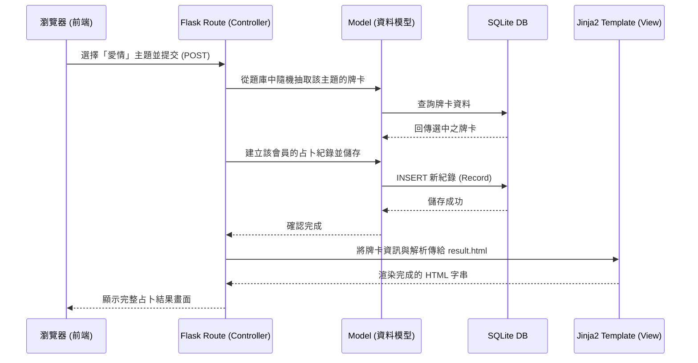

# 系統架構設計文件 (ARCHITECTURE) - 主題占卜系統

## 1. 技術架構說明
本專案採用傳統 Server-Side Rendering (SSR) 的架構，以 Python Flask 作為核心框架，適合初學者快速上手並理解網頁開發的基本流程。

- **後端框架：Python + Flask**
  - **原因**：Flask 輕量且有彈性，適合快速建立 MVP 並專注於占卜邏輯與會員驗證的開發。
- **模板引擎：Jinja2**
  - **原因**：Flask 內建支援，能直接將後端處理好的資料（如占卜結果、使用者名稱）插入 HTML 模板進行渲染，不需要處理複雜的前後端分離架構。
- **資料庫：SQLite**
  - **原因**：不需要額外架設資料庫伺服器，資料儲存在本地檔案中，非常適合中小型專案以及初期開發測試。

### MVC 架構模式說明
本專案遵守類似 MVC 的設計模式，整合至 Flask 的資料夾規劃中：
- **Model（模型）**：負責與 SQLite 資料庫溝通，定義如 `User` (會員), `Record` (占卜紀錄), `Card` (牌義資料) 等結構，並處理資料的讀寫邏輯。
- **View（視圖）**：Jinja2 下的 `.html` 模板，以及 `static/` 下的 CSS 與 JS，負責呈現網頁畫面與簡單的互動動畫。
- **Controller（控制器）**：Flask 的 Route 函式，負責接收使用者的網頁請求、驗證登入、呼叫 Model 取得或寫入資料、處理抽牌的隨機運算等邏輯，最後把資料拋給 View (Jinja2) 來產生網頁。

## 2. 專案資料夾結構

本專案將依照以下結構組織程式碼，確保職責分離且後續維護方便：

```text
web_app_development/
├── app/                      ← 應用程式主目錄
│   ├── __init__.py           ← 初始化 Flask App, 資料庫等配置 
│   ├── models/               ← 資料庫模型 (Model)
│   │   ├── __init__.py
│   │   ├── user.py           ← 使用者帳號 Model
│   │   ├── div_card.py       ← 占卜牌卡與題庫 Model
│   │   └── record.py         ← 使用者歷史紀錄 Model
│   ├── routes/               ← Flask 路由控制器 (Controller)
│   │   ├── __init__.py
│   │   ├── auth.py           ← 處理註冊、登入邏輯
│   │   ├── draw.py           ← 處理抽牌、運勢計算等核心邏輯
│   │   └── main.py           ← 處理首頁與靜態資訊頁面
│   ├── templates/            ← Jinja2 HTML 模板 (View)
│   │   ├── base.html         ← 共用版型 (網頁標頭、導覽列、頁尾)
│   │   ├── index.html        ← 首頁 (占卜主題選擇)
│   │   ├── login.html        ← 登入 / 註冊頁面
│   │   ├── draw.html         ← 抽卡動畫互動頁面
│   │   ├── result.html       ← 占卜結果與解析展示頁面
│   │   └── history.html      ← 個人歷史占卜紀錄頁面
│   └── static/               ← 靜態資源檔案 (瀏覽器直接讀取)
│       ├── css/              
│       │   └── style.css     ← 網站整體視覺樣式
│       ├── js/               
│       │   └── animation.js  ← 抽卡動畫與過場動效邏輯
│       └── images/           ← 塔羅牌圖案、系統 UI 圖片
├── instance/                 ← 運行時產生的實例資料夾 (不進版控)
│   └── database.db           ← SQLite 本地資料庫檔案
├── docs/                     ← 專案文件目錄
│   ├── PRD.md                ← 產品需求文件
│   └── ARCHITECTURE.md       ← 系統架構文件 (本文)
├── requirements.txt          ← 專案相依套件清單 (Flask 等)
└── app.py                    ← 專案啟動入口檔案 (執行 flask run 主體)
```

## 3. 元件關係圖

### 使用者請求基礎流程

```text
[ 瀏覽器 (使用者) ]
       │  ▲
 請求  │  │ 網頁回應 (Jinja2 HTML)
       ▼  │
[ Flask 路由 (Controller - app/routes) ]
       │  ▲
 讀寫  │  │ 回傳查詢資料 (Model)
       ▼  │
[ 資料模型 (Model - app/models) ]
       │  ▲
 SQL   │  │ 執行結果
       ▼  │
[ SQLite 資料庫 (instance/database.db) ]
```

### 占卜抽卡核心流程 (Mermaid)



## 4. 關鍵設計決策

1. **伺服器端產生占卜結果 (Server-side RNG)**
   - **原因**：抽卡的隨機結果由後端 (Flask) 的 `random` 模組或資料庫亂數產生，而非給前端 JS 計算。這能保證占卜邏輯的安全與神祕性，防止使用者透過修改前端代碼去操控抽牌結果。
2. **採用 Jinja2 模板直接渲染取代前後端分離 API**
   - **原因**：可以滿足專門提供「顯示結果」此類功能的輕便需求，少費工於處理繁瑣的跨域資源共用 (CORS)、前端狀態管理與 API JSON 設計。能用最快的速度打造出 MVP (最小可行產品)。
3. **限制每日抽卡次數的驗證機制**
   - **原因**：為了實作「每日運勢單日一抽」功能，依賴於資料庫的查詢。每次抽卡前，後端會檢查 `Record` 資料表中是否有該名 `user_id` 在「本日」的抽卡紀錄，有的話即回傳錯誤或導入已被抽出的結果，確保機制的正確性。
4. **Session 實作使用者狀態**
   - **原因**：使用傳統 HTTP 搭配 Flask 內建的 signed cookie based Session 實作登入驗證。開發門檻極低且穩定，不需引進像是 JWT 的複雜設定，與 Jinja2 的配合性極佳 (可在模板任意存取 `session` 變數來判斷登入狀態顯示切換)。
