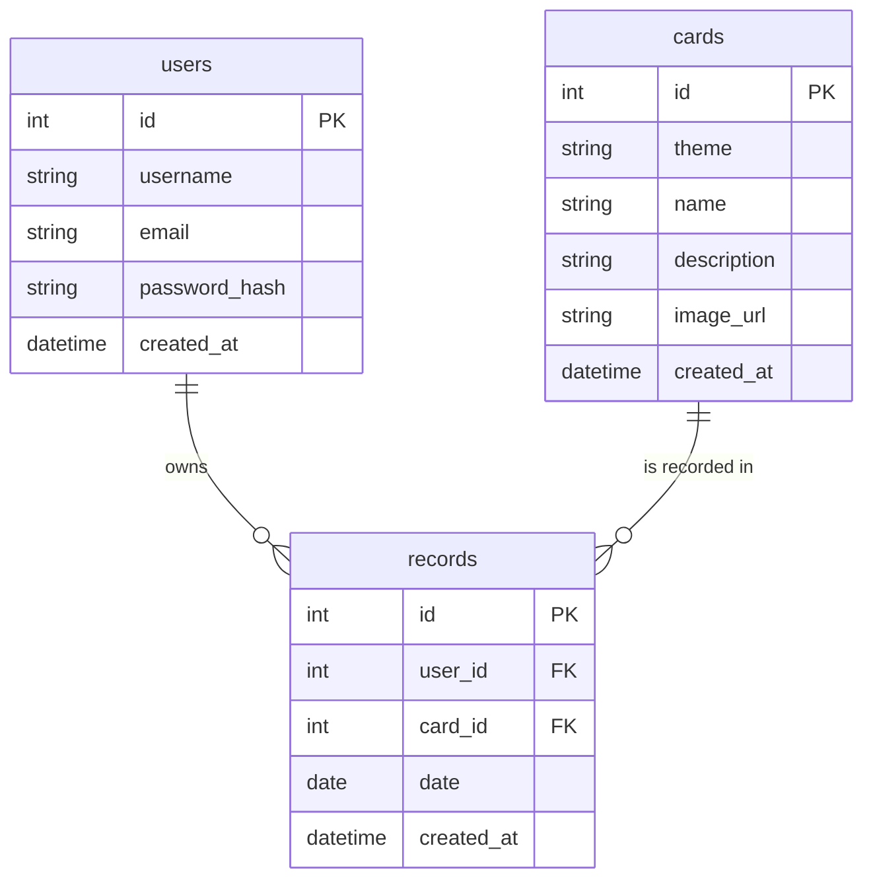

# DB Design Document - 主題占卜系統

本文件根據產品需求文件 (PRD) 與系統架構文件 (ARCHITECTURE) 的需求，規劃了 SQLite 的資料表設計與關聯。

## 1. ER 圖（實體關係圖）

## 2. 資料表詳細說明

### 2.1 `users` (使用者表)
儲存所有註冊用戶的帳號資訊。
- `id` (INTEGER): Primary Key，自動遞增。
- `username` (TEXT): 使用者名稱，必填且唯一。
- `email` (TEXT): 電子郵件，必填且唯一。
- `password_hash` (TEXT): 密碼 Hash 值 (如 bcrypt)，必填。
- `created_at` (TEXT): 建立時間戳記，預設為 `CURRENT_TIMESTAMP`。

### 2.2 `cards` (占卜牌卡題庫表)
儲存所有供抽取的牌卡或籤詩內容。對應不同主題。
- `id` (INTEGER): Primary Key，自動遞增。
- `theme` (TEXT): 分類主題 (如 'love', 'career', 'comprehensive')，必填。
- `name` (TEXT): 牌卡或籤詩名稱，必填。
- `description` (TEXT): 牌義解析或籤詩內容，必填。
- `image_url` (TEXT): 牌卡圖片路徑 (可選)。
- `created_at` (TEXT): 建立時間戳記，預設為 `CURRENT_TIMESTAMP`。

### 2.3 `records` (占卜紀錄表)
儲存使用者的抽卡歷史與每日運勢紀錄。
- `id` (INTEGER): Primary Key，自動遞增。
- `user_id` (INTEGER): Foreign Key，關聯至 `users(id)`，必填。
- `card_id` (INTEGER): Foreign Key，關聯至 `cards(id)`，必填。
- `date` (TEXT): 抽卡日期(僅含年月日 `YYYY-MM-DD`)，用於驗證每日一抽限制，必填。
- `created_at` (TEXT): 詳細建立時間，預設為 `CURRENT_TIMESTAMP`。

## 3. SQL 建表語法與 Python Models

- **SQL Schema**: 已產出至 `database/schema.sql` 檔案中。
- **Python Models**: 使用 `sqlite3` 實作的 CRUD 檔案已產出於 `app/models/` 目錄中，包含 `user.py`, `div_card.py`, `record.py`。
