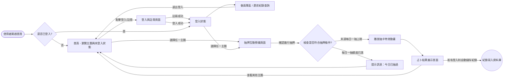
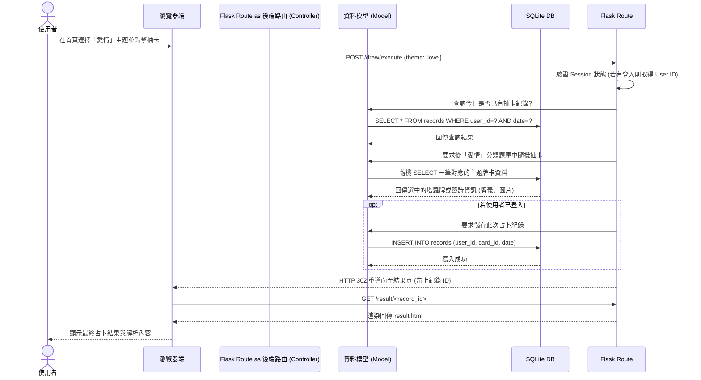

# 流程圖文件 (FLOWCHART) - 主題占卜系統

本文件根據 PRD 與系統架構文件所繪製，用於視覺化展現系統中「使用者操作路徑」與「資料系統流動」。

## 1. 使用者流程圖（User Flow）

以下圖表展示使用者從進入網站開始，可能經歷的所有主要操作與頁面跳轉邏輯。

## 2. 系統序列圖（Sequence Diagram）

以下圖表以核心功能「使用者進行抽牌並獲得結果」為例，展示各個系統元件間的互動順序與資料傳遞過程。

## 3. 功能清單對照表

本表列出每個功能對應的 URL 路由路徑與 HTTP 請求方法，以此作為後續 API 與路由設計的藍圖。

| 功能名稱 | URL 路徑 | HTTP 方法 | 對應控制器 (Route) | 說明 |
| --- | --- | --- | --- | --- |
| 首頁 (主題選擇) | `/` | GET | `main.py` | 顯示所有可選的占卜分類與網站介紹 |
| 使用者註冊 | `/auth/register` | GET / POST| `auth.py` | (GET) 顯示註冊表單，(POST) 接收資料寫入資料 |
| 使用者登入 | `/auth/login` | GET / POST| `auth.py` | (GET) 顯示登入表單，(POST) 驗證帳密並發放 Session |
| 使用者登出 | `/auth/logout` | GET | `auth.py` | 清除使用者 Session 並重導向至首頁 |
| 抽卡互動頁面 | `/draw/<theme>` | GET | `draw.py` | 進入特定分類之前的互動過場、準備畫面 |
| 執行抽卡邏輯 | `/draw/execute` | POST | `draw.py` | 後端執行隨機抽卡並儲存紀錄，處理完畢重導向至結果|
| 占卜結果展示 | `/result/<record_id>`| GET | `draw.py` | 呈現剛抽中之牌卡圖案及詳細解說內容 |
| 個人歷史紀錄 | `/history` | GET | `main.py` | 僅限會員訪問，透過撈取 DB 紀錄顯示先前的占卜歷程 |
